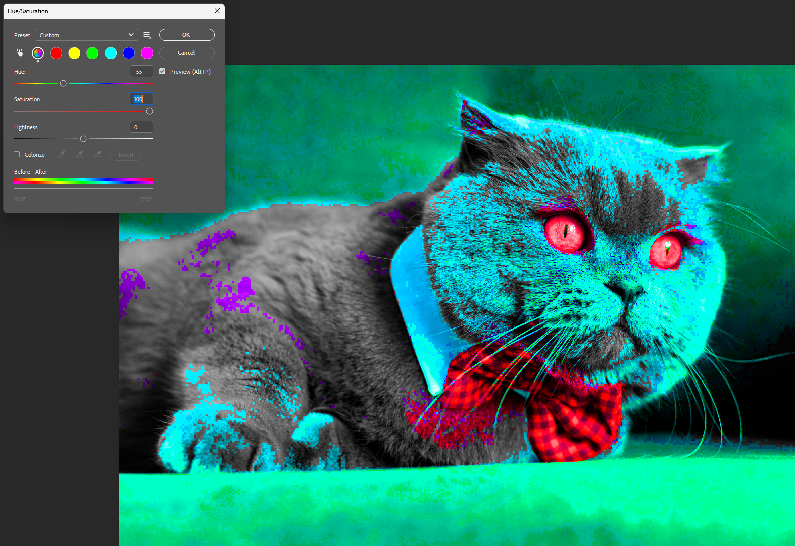

# Non-Destructive Editing in Photoshop

## Overview

Non-destructive editing allows you to make changes to an image without permanently altering the original pixels. Instead of editing directly on the image, you work with _Adjustment Layers_ and _Smart Objects_ — meaning you can always undo, tweak, or remove any change at any point without losing quality. This is the recommended way to edit in Photoshop, especially for beginners, as it gives you full creative freedom without the risk of ruining your original image.

## What You Will Learn

By the end of this section, you will be able to:

1. Understand the difference between destructive and non-destructive editing
2. Use _Adjustment Layers_ to edit colors and tones safely
3. Convert a layer into a _Smart Object_ to protect the original image

## Before You Begin

!!! warning
    Avoid editing directly on the **Background** layer — always duplicate it first by pressing `Ctrl + J`.

---

## Getting Started

This section will walk you through each step of non-destructive editing in Photoshop, from opening your image to saving your final file.

### Step 1: Download the Practice Image

**Download** the practice image here: [Click to Download](https://www.freepik.com/free-photo/adorable-british-shorthair-kitty-with-monochrome-wall-her_13863437.htm)

_Figure 1: Practice image — British Shorthair cat with bow tie_

Once downloaded, **locate** the file in your **Downloads** folder — it will be saved as a `.jpg` file.

---

### Step 2: Open the Image in Photoshop

1. **Open** Photoshop
2. **Click** [File] → [Open]
3. **Navigate** to where you downloaded the image
4. **Select** the image and **click** [Open]

!!! note
    You can also drag and drop the image directly into Photoshop.

---

### Step 3: Duplicate the Background Layer

Before making any edits, always duplicate your original layer to protect it. If you do not see the Layers panel, go to [Window] → [Layers] to open it.

  

1. **Right-click** on the Background layer in the Layers panel
2. **Select** [Duplicate Layer] or press `Ctrl + J`

    

    _Figure 2: Duplicating the Background layer_

!!! warning
    Never edit directly on the Background layer — always work on a duplicate.

---

### Step 4: The Destructive Way (What NOT to Do)

This section demonstrates what happens when you edit destructively, so you understand why it should be avoided.

1. **Click** [Image] → [Adjustments] → [Hue/Saturation]
2. **Drag** the Hue slider to any value
3. **Click** [OK]

    

    _Figure 3: Adjusting Hue/Saturation destructively_

    

    _Figure 4: The image is permanently changed_

!!! warning
    This permanently changes your image pixels. If you close and reopen the file, you cannot undo this change.

!!! warning
    Before continuing, press `Ctrl + Z` to undo this change, or close the
    file without saving and reopen it.

---

### Step 5: The Non-Destructive Way (The Right Way)

Instead of editing the image directly, we will add an _Adjustment Layer_ on top.

1. **Go to** [Layer] → [New Adjustment Layer] → [Hue/Saturation]
2. **Click** [OK] on the dialog that appears

    

    _Figure 5: Adding a Hue/Saturation Adjustment Layer_

3. **Drag** the Hue slider to -137

    

    _Figure 6: Adjusting the Hue slider_

4. **Click** the **eye icon** (the small eye symbol on the far left of the layer row) next to the Adjustment Layer in the Layers panel to toggle it on and off

    

    _Figure 7: Toggling the Adjustment Layer on and off_

5. **Double-click** the Adjustment Layer thumbnail at any time to go back and change the values

    

    _Figure 8: Re-editing the Adjustment Layer_

!!! note
    The Adjustment Layer sits _above_ your image and never touches the original pixels — you can modify or delete it at any time.

---

### Step 6: Rename Your Layers

Keeping your layers organized will save you a lot of confusion later.

1. **Double-click** the duplicated layer's name in the Layers panel
2. **Type** a descriptive name such as `Editing Layer`
3. **Press** `Enter` to confirm

    

    _Figure 9: Renaming the layer_

---

### Step 7: Convert the Layer to a Smart Object

Converting to a _Smart Object_ allows you to apply filters non-destructively.

1. **Right-click** on your duplicated layer in the Layers panel
2. **Click** [Convert to Smart Object]

    

    _Figure 10: Converting the layer to a Smart Object_

3. **Confirm** the conversion by looking for the small icon on the layer thumbnail

    

    _Figure 11: Smart Object icon confirming the conversion_

!!! note
    The small icon on the layer thumbnail confirms it is now a Smart Object. This means any filters you apply will be editable and non-destructive. When you **double-click** on it, Photoshop opens the Smart Object as a separate file (`.psb`). You can move any layers or content related to your edit into this Smart Object to keep things organized. Any edits made inside will apply back to your original file. **Save and close** the tab when done to see your changes reflected.

---

### Step 8: Apply a Filter to the Smart Object

1. **Click** [Filter] → [Blur] → [Gaussian Blur]

    

    _Figure 12: Opening the Gaussian Blur filter_

2. **Drag** the radius slider to around **5–10 pixels** to see a visible blur effect on your image
3. **Click** [OK]

    

    _Figure 13: Adjusting the Gaussian Blur radius_

!!! note
    Because this is a Smart Object, the filter appears as a _Smart Filter_ underneath the layer — it is fully editable at any time.

_Figure 14: Smart Filter visible in the Layers panel_

---

### Step 9: Edit the Smart Filter

After applying the Gaussian Blur in Step 8, you will see the filter name listed directly beneath the Smart Object layer in the Layers panel.

1. **Double-click** the Smart Filter name (e.g., _Gaussian Blur_) in the Layers panel
2. **Adjust** the slider to a new value
3. **Click** [OK]

!!! note
    This is the power of non-destructive editing — you can always go back and change any filter without starting over.

---

### Step 10: Save Your File

To preserve all your layers and edits, save as a Photoshop file.

1. **Click** [File] → [Save As]
2. **Set** the format to `.psd`
3. **Click** [Save]

!!! warning
    Saving as `.jpg` or `.png` will flatten all your layers and you will lose all your non-destructive edits permanently.

---

### Bonus

To test your understanding, here is a finished Photoshop image that you should be able to recreate after going through this tutorial. It involves everything you have been taught.

_Figure 15: Completed example using Adjustment Layers and Smart Objects_

## Conclusion

You have successfully completed the Non-Destructive Editing tutorial. You now know how to use _Adjustment Layers_ and _Smart Objects_ to edit images safely in Photoshop without ever permanently altering your original image. These techniques are the foundation of professional photo editing and will be used throughout the rest of your careers.
